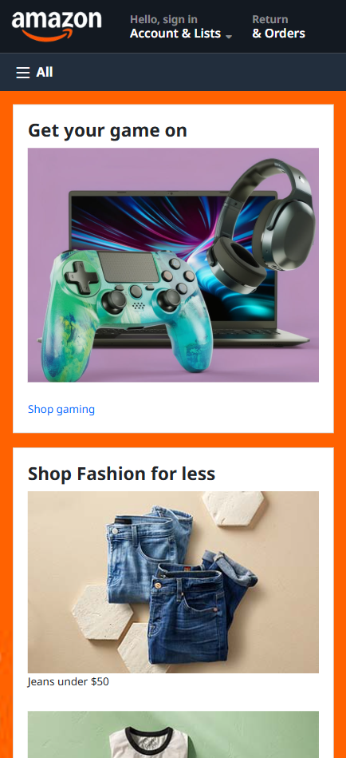
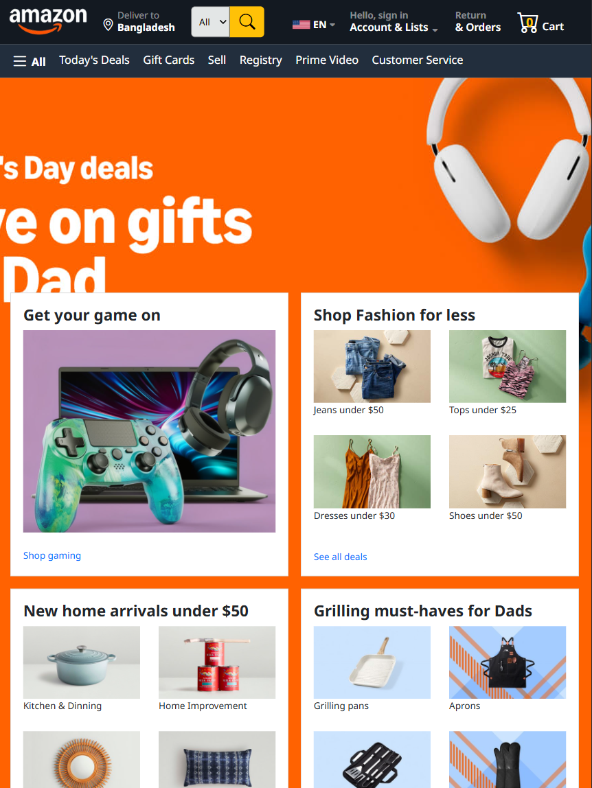
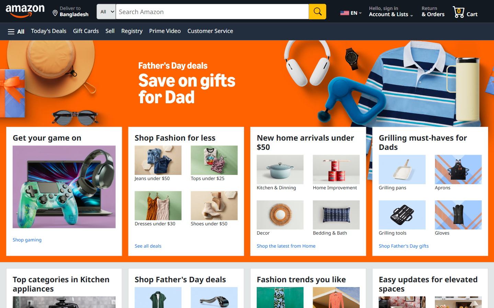

<h1 align="center">📦 Amazon Clone</h1>

**Started:** 21 May 2026  
**Last Updated:** 03 June 2026

A modern and responsive Amazon clone built using only **HTML**, **CSS**, and **Bootstrap**. This project focuses on a sleek digital retail UI, an organized multi-category marketplace layout, and a polished online shopping experience without JavaScript or a backend.

---

## 🛠️ Technologies Used

| Technology | Usage                 |
| ---------- | --------------------- |
| HTML       | Structure and content |
| CSS        | Styling and layout    |
| Bootstrap  | UI framework          |

---

## 📁 Project Structure

```text
amazon-clone/               # Project Name
├── assets/                 # Non-Code Files
│   ├── card-images/        # Cards Images
│   ├── images/             # Base Images
├── README.md               # Project Documentations
├── index.html              # HTML Codes
└── style.css               # CSS Codes
```

---

## ✨ Features

- 📱 Responsive Amazon-style marketplace layout.
- 🎠 Hero section with a responsive deals.
- 📦 Multi-category product grids and deal rows.
- 💫 Smooth hover effects on product cards and buttons.
- 🧭 Clean navigation bar with cart and delivery selectors.
- 🎨 Fully built with HTML, CSS, and Bootstrap only.
- ⚡ Easy to customize for personal projects.

---

## ⚠️ Challenges Faced

- **Static Functionality Limitations:** Replicating dynamic features like adding items to a shopping cart or updating the cart badge counter using strictly static HTML, CSS, and Bootstrap without JavaScript.
- **Handling Product Image Layouts:** Maintaining perfectly uniform card sizes in the multi-category marketplace grid when different product images had varying dimensions and aspect ratios.
- **Responsive Navbar Complexity:** Managing Amazon’s heavy and complex navigation bar layout (delivery location, search bar, language, and cart) purely through Bootstrap's grid system across smaller mobile screens.

---

## 🧠 What I Learned

- Building a visually appealing online marketplace interface.
- Organizing a frontend project for maintainability.
- Implementing complex multi-item navigation bars using Bootstrap.
- Designing responsive product grids for various screen sizes.
- Customizing Bootstrap components to match Amazon's branding.

---

## 🖼️ Screenshot

<p align="center">
    <h4>1. Phone Screen:</h4>
    
</p>

<p align="center">
    <h4>2. Tab Screen:</h4>
    
</p>

<p align="center">
    <h4>3. Laptop or Desktop Screen:</h4>
    
</p>

---

## 🙌 Acknowledgements

- Inspired by the Amazon UI.
- Built as a frontend practice project using HTML, CSS and Bootstrap.

---

## 🌐 Live Demo

You can check out the live preview of this project by clicking the link below:

▶️ [Live Preview](https://dipu-ray.github.io/amazon-clone/)

---

<div align="center">

Made with ❤️ and Bootstrap <br>
⭐ If you like this project, feel free to give it a star!

</div>
